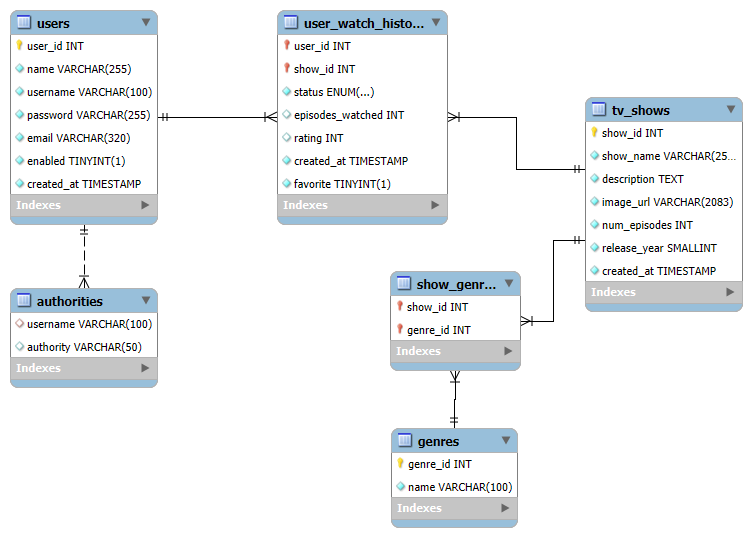

# Media Tracker API 

This is the backend REST API for **Media Tracker**, a full-stack project designed to help users track their consumption of TV shows, books, and music. Built with Java and Spring Boot, this API features secure authentication, modular architecture, custom exception handling, and comprehensive test coverage.

> 📌 This repo is an extended evolution of my Cognixia Capstone project, originally built to track TV watch history. The scope is now expanding to support multiple media types and deeper tracking functionality.

---

## 🎯 Project Objective

To build a scalable, secure, and maintainable backend service that allows users to track, update, and analyze their media consumption history — including TV shows, books, and music — with robust data persistence, RESTful APIs, and clean architectural patterns.

---

## ✅ Key Features

- **User Authentication** via Spring Security and `JdbcUserDetailsManager`
- **BCrypt-encrypted passwords** for secure login
- **Track media consumption** across TV shows, books, and music
- **Flexible architecture** ready for multi-media support
- **Layered REST API design** (Controller → Service → DAO)
- **Custom Exception Handling** with `@ControllerAdvice`
- **Modular and Testable Codebase**
- **SQL seed script** for local setup
- **Swagger/OpenAPI** documentation
- **Javadoc HTML Documentation** for maintainability
- **JaCoCo Test Coverage Report** (80%+)

---

## 🗂️ Entity Relationship Diagram (ERD)



---

## 📖 API Documentation

- 🔍 **Swagger/OpenAPI UI**  
  View live docs when the app is running:  
  [http://localhost:8080/swagger-ui/index.html](http://localhost:8080/swagger-ui/index.html)

- 📚 **Javadoc HTML Docs**  
  Located in the `/docs` folder:  
  `./docs/index.html`

---

## 📈 Test Coverage

- ✅ **170+ unit/integration tests**
- 🧪 Layers tested: DAO, Service, Controller, Exception Handling
- 📊 Code coverage: 80%+ (JaCoCo)
- 🛡️ Tests ensure application reliability and maintainability

---

## 📌 Core Endpoints (Current TV Module)

| Method | Endpoint | Description |
|--------|----------|-------------|
| GET    | `/api/shows`            | Fetch all TV shows |
| GET    | `/api/watch-history`    | Fetch user's tracked shows |
| POST   | `/api/watch-history`    | Add show to watch history |
| PUT    | `/api/watch-history`    | Update watch status |
| DELETE | `/api/watch-history/{showId}` | Remove from watch history |

> 🔐 All `/watch-history` endpoints require Basic Auth

---

## 🛠 Technologies Used

- Java 17  
- Spring Boot  
- Spring Security  
- JDBC (manual, no Hibernate)  
- MySQL  
- Maven  
- Swagger (Springdoc OpenAPI)  
- JaCoCo  
- Javadoc

---

## 🚀 How to Run Locally

1. **Clone the project**
   ```
   git clone https://github.com/jmill29/media-tracker-api.git
   cd media-tracker-api
   ```

2. **Set up the MySQL database**
   - Open MySQL Workbench or CLI
   - Run the schema seed script:  
     `src/main/resources/media_tracker_schema_seed.sql`

3. **Configure `application.properties`**
   ```
   spring.datasource.url=jdbc:mysql://localhost:3306/media_tracker
   spring.datasource.username=your_mysql_user
   spring.datasource.password=your_mysql_password
   ```

4. **Run the application**
   ```
   mvn spring-boot:run
   ```

---

## 🧪 Sample Request

**POST /api/watch-history**

Request Body:
```json
{
  "show_id": 3,
  "status": "Watching"
}
```

Header:
```
Authorization: Basic base64encoded(username:password)
```

---

## 🛤️ Project Roadmap

Planned enhancements for future versions include:

- 🔐 Switch from Basic Auth to JWT-based Authentication (Access + Refresh Tokens)
- ☁️ Deploy backend to AWS using ECS or Fargate
- 🌐 Create a modern React frontend (deployed via S3 + CloudFront)
- 📚 Extend tracking to **books** and **music**
- 🕓 Implement full **media activity logging** (timestamped watch/read/listen changes)
- 📊 Add analytics endpoints and personalized summaries

---

## 📂 Related Links

- 🔗 [Original Capstone Backend Repo](https://github.com/jmill29/tv-show-tracker-api)
- 🔗 [Original Capstone Frontend (CLI App)](https://github.com/jmill29/tv-tracker-frontend)
- 📋 [Media Tracker Kanban Board](https://github.com/users/jmill29/projects/1)

---

## 🙌 Credits

This project builds upon the foundational work completed for my Cognixia Future Horizons Capstone. Huge thanks to the Cognixia team for their training and guidance.

— Jacob Miller
